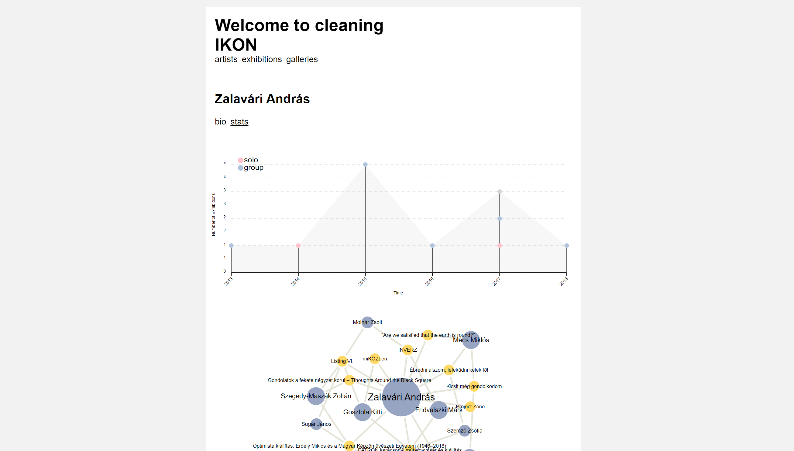

# ikon.view

working demo:
https://zalavariandris.github.io/ikon.view/



## TODOS
- [x] Landing page
  - [ ] unified search with levenshtein distance

- [ ] get rid of toplist

- [x] move to graphology network representation

- ExhibitionView
  - [x] add description for exhibitions from ikon.hu/archive

- Store
  - [x] return date as ISO string 

- Utils
  - [x] group list of dict by key

- ArtistView
  - [x] biparted ego network
    - [ ] add curating and opening relation with edge colors
    - [ ] color people nodes by profession
  - [x] tag solo exhibitions
  - [x] CV: group exhibitions by year
  - [ ] in curating or openingspeech sections, show artists, when not too many
  - [ ] sort exhibiting, curating openingspeech secionts by count

- ArtistsListView
  - [ ] exhibition, opening and curating count

- GalleryView
  - [x] group exhibitions by year
  - [ ] ego network

- vgraph
  - [x] d3graph
  - [ ] sigma
  - [ ] sigma with d3 force layout
  - [ ] d3 with custom threejs renderer
  - [ ] selection
  - [ ] editing

- d3graph
  - [x] zoom to fit content
  - [x] filter not exhibition events from graph

- [ ] create deploy to gh-pages script

- [ ] express api server
- [ ] editing

## Deploy to gh-pages
https://medium.com/@Roli_Dori/deploy-vue-cli-3-project-to-github-pages-ebeda0705fbd
- add remote from github
- create gh-pages branch
```
npm run build
git add -f dist && git commit -m "dist subtree commit2"
git subtree push --prefix dist origin gh-pages
git rm -r dist --cached
```
